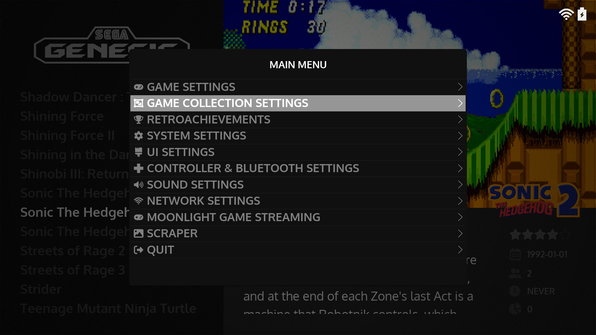

  
  <video autoplay loop muted><source src="_inc/video/preview.mp4" type="video/mp4"></video>

# Bem-vindo a Wiki do JELOS :material-gamepad:

   
   

"Just Enough Linux Operating System" (JELOS) É uma distribuição Linux imutável, sendo direcionada para dispositivos portáteis, focados em emulação de jogos retro. Ele é desenvolvido por uma pequena comunidade de entusiastas, e nosso objetivo é fazer um sistema operacional que tenha os recursos e capacidades que precisamos, e nos divertimos enquanto o desenvolvemos.

## Recursos

- Sistema de jogatina via internet, multi-dispositivo, com suporte local e/ou remoto.
- Comandos touch durante jogatina em dispositivos suportados.
- Controle refinado de bateria, tanto para tempo de vida quanto desempenho.
- Suporte para tocar Músicas e Vídeos.
- Suportes para áudio bluetooth e controle bluetooth.
- Suporte para saída HDMI de áudio e video, e USB somente para áudio.
- Sincronização entre dispositivo e para nuvem, utilizando Syncthing e rclone.
- Suporte a VPN com Wireguard, Tailscale e ZeroTier.
- Suporte padrão para scraping e retroachievements.

## Preview

<table>
  <tr>
    <td></td>
    <td></td>
  </tr>
  <tr>
    <td></td>
    <td></td>
  </tr>
</table>

## Comunidade

A comunidade JELOS utiliza o Discord para discussões, se você deseja se juntar a nós por favor utilize esse link: &nbsp;[:simple-discord: Discord](https://discord.gg/seTxckZjJy)

## Licença

JELOS é uma distribuição Linux feita por diversos componentes de código aberto. Cada componentes é distribuída sobre sua própria licença. Essa distribuição inclui componentes licenciados apenas para uso não comercial.

### Sobre a marca JELOS

A marca JELOS e as imagens são todas licenciadas sobre a [Creative Commons Attribution-NonCommercial-ShareAlike 4.0 International License](https://creativecommons.org/licenses/by-nc-sa/4.0/).

Você é livre para:
- Compartilhar: copiar e redistribuir o material em qualquer meio ou formato.
- Adaptar: modificar, transformar, e construir sobre o material.

Sob os seguintes termos:

- Atribuição: Você deve atribuir os créditos, disponibilizando o link para a licença e indicando se alguma modificação foi feita. Você pode fazê-lo de qualquer maneira, mas não de qualquer maneira que sugira que o licenciador endossa você ou o seu uso.
- Não comercial: você não pode utilizar esse material com fins comerciais.
- Compartilhe como o original: se você modificar, transformar ou construir sobre o material, você deve distribuir suas contribuições com a mesma licença do original.

### Software JELOS

Copyright 2023 JELOS (https://github.com/JustEnoughLinuxOS)

Os Softwares e scripts desenvolvidos pelo time do JELOS, é licenciado sob os termos do [GNU GPL Version 2](https://choosealicense.com/licenses/gpl-2.0/). A licença completa pode ser encontrada na pasta de licenças do projeto.

### Projetos embutidos
Todos outros softwares são provindos sob a licença de cada componente. Essas licenças podem ser encontradas na raiz de cada software ou na pasta de licenças desse projeto. Modificações nos softwares embutidos e scripts feitos pelo time JELOS devem seguir com a mesma licença e seguir os termos do software após ser modificado.

## Créditos

Como qualquer distribuição Linux, esse projeto não é o trabalho de uma única pessoa. Esse é o trabalho de várias pessoas por todo o mundo, que desenvolveram pedaços de código aberto, que sem eles esse projeto não poderia existir. Um agradecimento especial para CoreELEC, LibreELEC e para os desenvolvedores e contribuidores pela comunidade open source
